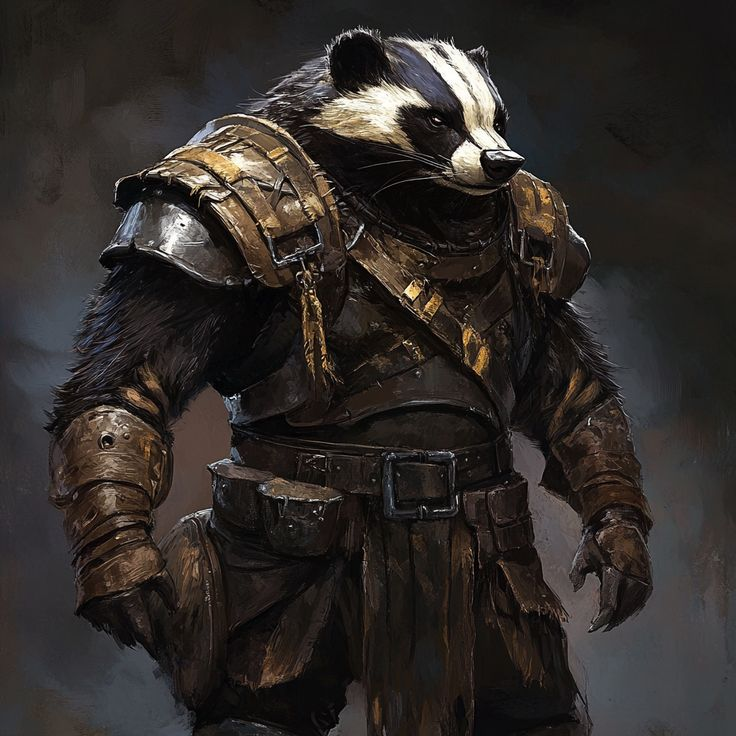

# 🦡 Как добавить именно твое изображение барсука-воина

## 📸 Пошаговая инструкция:

### Шаг 1: Сохрани изображение
1. **Правый клик** на изображении барсука-воина
2. Выбери **"Сохранить изображение как..."**
3. Назови файл: `badger-warrior.jpg`
4. Сохрани в папку: `C:\Users\ypost\landing-page-project\images\`

### Шаг 2: Проверь файл
После сохранения в папке `images` должен появиться файл `badger-warrior.jpg`

### Шаг 3: Обнови HTML код
Замени в файле `index.html` строку:
```html

```

На:
```html

```

### Шаг 4: Обнови страницу
Нажми **F5** в браузере или обнови страницу

## 🎯 Описание твоего изображения:
- Барсук-воин в детализированных доспехах
- Темная палитра с золотистыми акцентами
- Серьезное выражение морды
- Стиль фэнтези/средневековья
- Высокое качество изображения

## ⚡ Быстрый способ:
1. Скопируй изображение
2. Вставь в Paint или другой редактор
3. Сохрани как `badger-warrior.jpg` в папку `images`
4. Обнови HTML код (см. выше)
5. Обнови страницу

## 🔧 Если что-то не работает:
- Проверь, что файл находится в папке `images`
- Убедись, что имя файла точно `badger-warrior.jpg`
- Проверь, что HTML код обновлен правильно
- Попробуй очистить кэш браузера (Ctrl+F5)

## 📱 Альтернативный способ:
Если не получается сохранить как JPG, можешь:
1. Сохранить как PNG: `badger-warrior.png`
2. Обновить HTML: `src="images/badger-warrior.png"`

Твое изображение будет выглядеть потрясающе в главном блоке! ⚔️🦡 